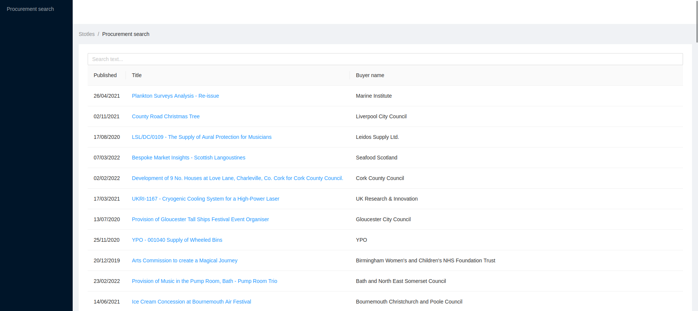

# Tender Wall of Fame

## Getting started

This codebase consists of a separate client & server code.

It's set up in a simple way to make it as easy as possible to start making changes,
the only requirement is having recent versions of `node` & `npm` installed.

This is not a production ready configuration (nor production ready code),
it's only set up for easy development, including live reload.

To run the client bundler:

```
cd client
npm install
npm run dev
```

The processed code will be available at http://localhost:3001

To start the server:

```
cd server
npm install
npm run dev
```

The server will be available at http://localhost:3000 - the page is automatically configured
to use the assets served by vite on port 3001.

You should see something similar to this page:



### Disabling/Enabling TypeScript

If you prefer to completely disable TypeScript for a file, add `// @ts-nocheck` on the first line.
If on the other hand you'd like to enable strict type checking, modify `tsconfig.json` according to your needs.

Note that you can import plain JavaScript files that won't be fully typechecked.

### Browsing the database

You should start by looking at the migration in `./migrations` folder.
If you prefer to browse the DB using SQL, you can use the sqlite command line (just run `sqlite3 ./db.sqlite3`)
or any other SQL client that supports sqlite.

If for any reason the database becomes unusable, you can rebuild it using `./reset_db.sh` script`.

## Further improvements

### 1. Make search experience better

- Add filter by date & value
- Filter suggested buyers according to other filters settings (suggest only buyers from records matching current filter settings)
- Add pagination controls: select page size, buttons to jump to any page
- Add sorting for all columns
- Consult with UI/UX designer

### 2. Tech dept

#### Client:

- When you scroll beyond the page limits wite space appears. Fix the page.
- Display values in readble format (for exampe: insted of 10000 -> 10K ).
- Add title for main page header or delete header area .
- Process record description: delete "\n" from the text.
- Make `ProcurementRecordPreview` component of a flexible width according to size of the description text.
- Add spacing around the close button in `ProcurementRecordPreview` component. Otherwise the title gets overlapped the button. (for example you can open title "Provision of Music in the Pump Room, Bath - Pump Room Trio")
- Investigate why if you once clicked the "load more" button (`RecordSearchPage`), it turned blue and no longer changes color when you hover over it.
- Add space between button "load more" and `RecordsTable`.
- Make left panel on the main page folding.

#### Server:

- Divide `main.ts` to files with single responsibility logic (queries, route)
- Find neat and scalable solution for `searchRecords` function.
- Add sorting capabilities.
- Add posibility to filter records by date and value.
- Add unit tests.

### 3. Difficulties

- Googled a lot about React due to no prior experience.
- Struggled with neat and scalable solution for `searchRecords` function so used ugly but functional.
